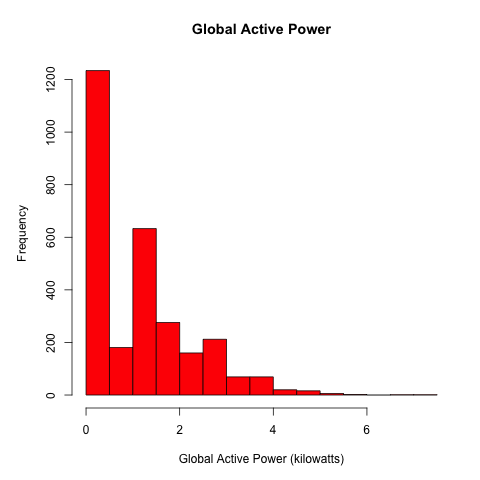
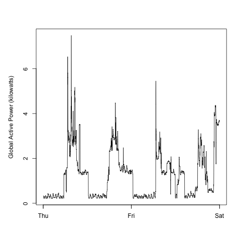
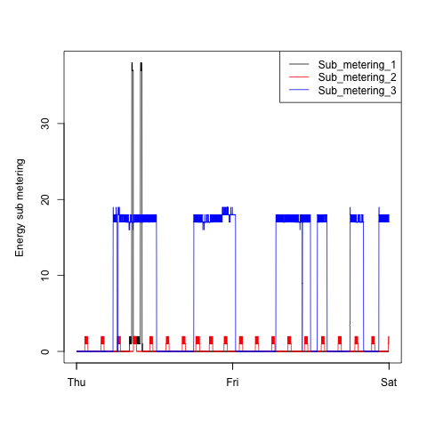
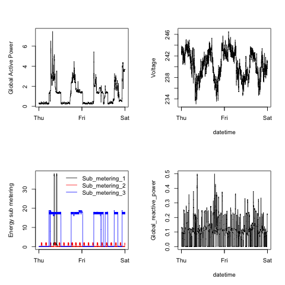

# Project and data description

This project is part of the [Exploratory Data Analysis](https://class.coursera.org/exdata-034/) 4-weeks online course offered by the [Johns Hopkins Bloomberg School of Public Health](http://www.jhsph.edu/) (Baltimore, USA) on [Coursera](https://www.coursera.org). [Exploratory Data Analysis](https://class.coursera.org/exdata-034/) is the fourth course of the 11-months [JH Data Science Specialization](https://www.coursera.org/specialization/jhudatascience/1). 

This assignment uses data from the [UC Irvine Machine Learning Repository](http://archive.ics.uci.edu/ml/) and focuses on the "Individual household electric power consumption Data Set" available [here](https://d396qusza40orc.cloudfront.net/exdata%2Fdata%2Fhousehold_power_consumption.zip) [20Mb].   
    
This dataset contains 2 075 259 measurements (i.e. rows) of electric power consumption gathered in one household with a one-minute sampling rate over a period of 47 months, between December 2006 and November 2010. 9 different electrical quantities and some sub-metering values are available, hence the 9 columns in the dataset. The following descriptions of the 9 variables in the dataset are taken from
the [UCI web site](https://archive.ics.uci.edu/ml/datasets/Individual+household+electric+power+consumption) :

- **Date** : Date in format dd/mm/yyyy

- **Time** : time in format hh:mm:ss

- **Global_active_power** : household global minute-averaged active power (in kilowatt)

- **Global_reactive_power** : household global minute-averaged reactive power (in kilowatt)

- **Voltage** : minute-averaged voltage (in volt)

- **Global_intensity** : household global minute-averaged current intensity (in ampere)

- **Sub_metering_1** : energy sub-metering No. 1 (in watt-hour of active energy). It corresponds to the kitchen, containing mainly a dishwasher, an oven and a microwave (hot plates are not electric but gas powered)

- **Sub_metering_2** : energy sub-metering No. 2 (in watt-hour of active energy). It corresponds to the laundry room, containing a washing-machine, a tumble-drier, a refrigerator and a light

- **Sub_metering_3** : energy sub-metering No. 3 (in watt-hour of active energy). It corresponds to an electric water-heater and an air-conditioner

# Downloading the data

The following R script was used to download and unzip the raw data archive programatically :

    ## Data downloading script

    ## check if a "data" directory exists in the current working directory and create it if not
    if (!file.exists("data")) { 
        dir.create("data")
    }

    ## download the file
    fileUrl <- "https://d396qusza40orc.cloudfront.net/exdata%2Fdata%2Fhousehold_power_consumption.zip"
    download.file(fileUrl, "./data/household_power_consumption.zip", method = "curl")

    ## unzip the file in the "data" sub-directory
    unzip("./data/household_power_consumption.zip", exdir = "./data/")

    ## save and print the download time and date
    downloadedDate <- date()
    print("File downloaded and unzipped on :")
    print(downloadedDate)
    cat("\n")

    ## delete the original zip file once it's been unzipped
    unlink("./data/household_power_consumption.zip")
    print("Original zip file deleted. Bye !")

The script was ran using ```source("download.R")```.


# Loading and processing the data

My four R scripts - plot1.R, plot2.R, plot3.R and plot4.R - all require the [Lubridate package](https://cran.r-project.org/web/packages/lubridate/index.html) to be installed. The four scripts all follow a common loading and processing path :

1. Read the data .txt file into an R data frame using the ```read.table``` function as follows :

```read.table(file = "./data/household_power_consumption.txt", header = TRUE, 
              sep = ";", na.strings = "?", stringsAsFactors = FALSE)```

2. Convert the three *Sub_metering* columns to integer using the ```as.integer``` function

3. Convert the *Date* and *Time* variables into POSIXct variables and then merge them into a new single column called *dateTime* using the ```paste``` function and the ```dmy_hms``` function from the [Lubridate package](https://cran.r-project.org/web/packages/lubridate/index.html). After that the two original columns are removed from the data set.

4. Select the relevant time range in the data set, keeping only the rows related to the 1st and 2nd of February 2007 as stated in the project instructions.      
          
The resulting tidy data set is called **hhpowcon12** (for **h**ouse**h**old **pow**er **con**sumption on the **1**st and **2**nd of February 2007) and has 2 880 rows (1 440 observations per day, i.e. one per minute) and 8 columns (as the 2 original date and time columns were merged).


# Plotting

Once the data is loaded and processed the plotting can begin. Our overall goal here was to examine how household energy usage varied over a 2-day period in February 2007 (2007-02-01 and 2007-02-02) and to reconstruct 4 plots using R base plotting system.

First we were asked to fork and clone the following GitHub repository:
[https://github.com/rdpeng/ExData_Plotting1](https://github.com/rdpeng/ExData_Plotting1)

Then for each plot we were asked to :

- Construct the plot and save it as a PNG file with a width and a height of 480 pixels

- Name each of the plot files as `plot1.png`, `plot2.png`, etc.

- Create a separate R code file (`plot1.R`, `plot2.R`, etc.) that constructs the corresponding PNG plot, including the code which was used for reading the data so that the plot can be fully reproduced

- Add the PNG file and R code file to our GitHub repository

# My plots :

The four plots that I constructed for the project are shown below along with the corresponding plotting R code (the PNG and R files are also available here in my [GitHub repo](https://github.com/cdromain/ExData_Plotting1)) :


## Plot 1

 

    png(filename = "plot1.png", width = 480, height = 480)
    par(mfcol = c(1, 1), mar = c(5, 5, 4, 2))
    hist(hhpowcon12$Global_active_power, xlab = "Global Active Power (kilowatts)", 
         main = "Global Active Power", col = "red")
    dev.off()

## Plot 2

 

    my_locale <- Sys.setlocale("LC_TIME") ## preserving the existing locale
    Sys.setlocale("LC_TIME", "en_GB.UTF-8") ## changing locale to English
    png(filename = "plot2.png", width = 480, height = 480)
    par(mfcol = c(1, 1), mar = c(5, 5, 4, 2))
    plot(hhpowcon12$dateTime, hhpowcon12$Global_active_power, xlab = "", 
         ylab = "Global Active Power (kilowatts)", type = "n")
    lines(hhpowcon12$dateTime, hhpowcon12$Global_active_power)
    dev.off()
    Sys.setlocale("LC_TIME", my_locale) ## restoring original locale


## Plot 3

 

    my_locale <- Sys.setlocale("LC_TIME") ## preserving the existing locale
    Sys.setlocale("LC_TIME", "en_GB.UTF-8") ## changing locale to English
    png(filename = "plot3.png", width = 480, height = 480)
    par(mfcol = c(1, 1), mar = c(5, 5, 4, 2))
    plot(hhpowcon12$dateTime, hhpowcon12$Sub_metering_1, xlab = "", 
         ylab = "Energy sub metering", type = "n")
    lines(hhpowcon12$dateTime, hhpowcon12$Sub_metering_1, col = "black")
    lines(hhpowcon12$dateTime, hhpowcon12$Sub_metering_2, col = "red")
    lines(hhpowcon12$dateTime, hhpowcon12$Sub_metering_3, col = "blue")
    legend("topright", legend = c("Sub_metering_1", "Sub_metering_2", "Sub_metering_3"), 
           col = c("black", "red", "blue"), lty=c(1,1))
    dev.off()
    Sys.setlocale("LC_TIME", my_locale) ## restoring original locale

## Plot 4

 

    my_locale <- Sys.setlocale("LC_TIME") ## preserving the existing locale
    Sys.setlocale("LC_TIME", "en_GB.UTF-8") ## changing locale to English
    png(filename = "plot4.png", width = 480, height = 480)
    par(mfcol = c(2, 2), mar = c(5, 5, 4, 2))
    
        # Plot 4A (top left)
    plot(hhpowcon12$dateTime, hhpowcon12$Global_active_power, xlab = "", 
         ylab = "Global Active Power", type = "n")
    lines(hhpowcon12$dateTime, hhpowcon12$Global_active_power)

        # Plot 4B (bottom left)
    plot(hhpowcon12$dateTime, hhpowcon12$Sub_metering_1, xlab = "", 
         ylab = "Energy sub metering", type = "n")
    lines(hhpowcon12$dateTime, hhpowcon12$Sub_metering_1, col = "black")
    lines(hhpowcon12$dateTime, hhpowcon12$Sub_metering_2, col = "red")
    lines(hhpowcon12$dateTime, hhpowcon12$Sub_metering_3, col = "blue")
    legend("topright", legend = c("Sub_metering_1", "Sub_metering_2", "Sub_metering_3"), 
           col = c("black", "red", "blue"), lty=c(1,1), bty = "n")

        # Plot 4C (top right)
    plot(hhpowcon12$dateTime, hhpowcon12$Voltage, xlab = "datetime", 
         ylab = "Voltage", type = "n")
    lines(hhpowcon12$dateTime, hhpowcon12$Voltage)

        # Plot 4D (bottom right)
    plot(hhpowcon12$dateTime, hhpowcon12$Global_reactive_power, xlab = "datetime", 
         ylab = "Global_reactive_power", type = "n")
    lines(hhpowcon12$dateTime, hhpowcon12$Global_reactive_power)

    dev.off()
    Sys.setlocale("LC_TIME", my_locale) ## restoring original locale

# Additional information

- My R version being in French, I had to change programatically my locale settings to English so the days of the week could be displayed in English in my plots, just like in the plots we had to reconstruct. For that I used the ```Sys.setlocale``` function along with the ```"LC_TIME"``` argument. My scripts end by restoring the locale settings to their original French values that were stored in a temporary variable.

- This analysis was done in RStudio 0.99.467 (R version 3.2.2 (2015-08-14) -- "Fire Safety") on Mac OSX 10.10.5.